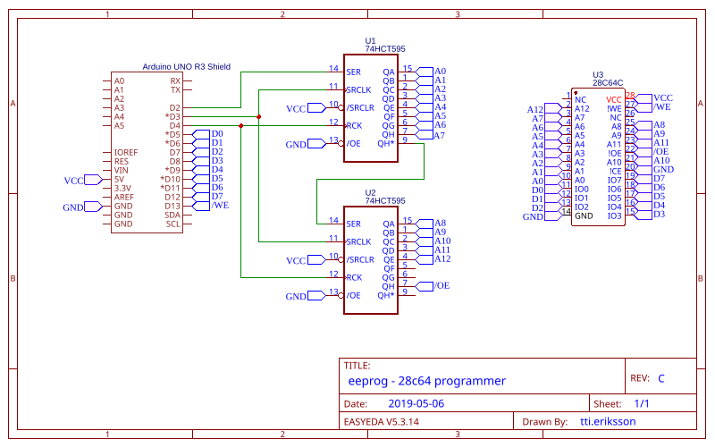

# eeprog

This is **eeprog** - EEPROM programmer on the ATmega328 microcontroller.

I developed this project mainly as an alternative to commercial EEPROM programmers for hobbyists,
using commonly available Arduino Uno boards.
Future versions of this project might be a standalone board that doesn't require an Arduino Uno to work,
but at the time writing this there is no real need for this further development as the project is essentially feature complete and have been used in real hardware projects to program EEPROMs.

## Hardware

The hardware is implemented as a shield for the Arduino Uno R3, utilizing the digital I/O ports for shifting data and address.

The shield only supports the 8K AT28C64 EEPROM at this moment, but could be modified to support larger EEPROMs.

## Software

This repository comes with a CLI programmer tool written in Python,
that can be used to write and dump the data on the EEPROM.

For more information about the tool, check out its [subdirectory](cli/) in this repository.

## LICENSE

This whole project is licensed under the open source [MIT license](./LICENSE).